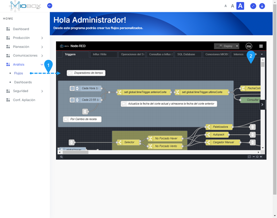
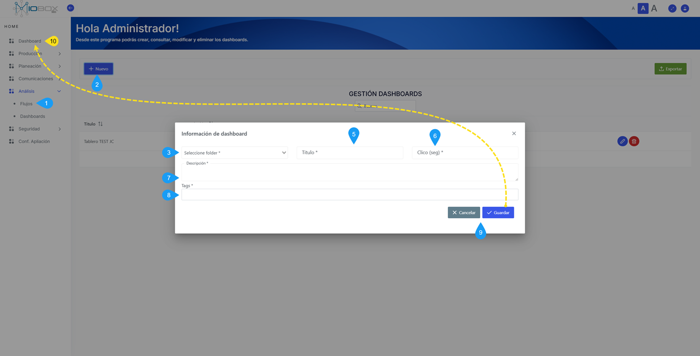
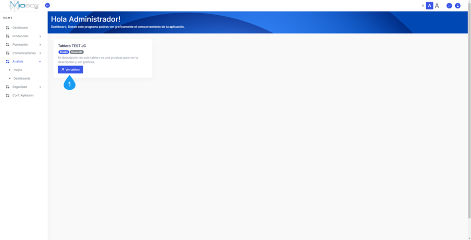
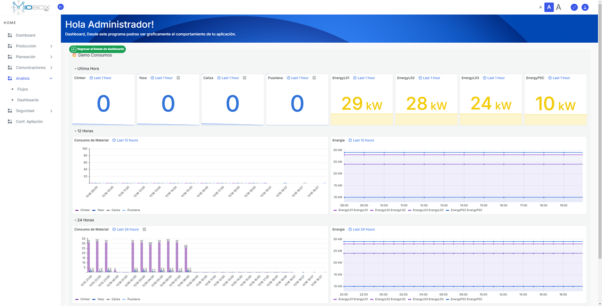

---
prev:
  text: 'Tareas'
  link: '/comunicaciones/tareas'
next:
  text: 'Seguridad'
  link: '/Seguridad/index'
---
# Análisis  

El módulo de análisis contiene los componentes **Flujos** y **Dashboard**. El componente Flujos permite la creación de lógicas personalizadas para operar con los tags o cualquier otra lógica necesaria en la inteligencia del negocio.  

  

## Dashboard  

Una vez que active el módulo de análisis, podrá acceder a los paneles de análisis que defina y agregarlos al menú de visualización del Dashboard. Para hacer esto, siga los siguientes pasos:  

::: tip  
*Solo podrá acceder a estas opciones si ha adquirido MIOBOX con el módulo de **análisis activo**.*  
:::  

::: tip  
*Por defecto, podrá encontrar un panel demo. Esto no siempre indica que cuenta con el módulo de análisis activo, ya que el módulo demo no permite la edición o creación de nuevos paneles de visualización.*  
:::  

### Pasos para Enlazar un Panel de Visualización  

1. Acceda al componente Dashboard.  
2. Agregue un nuevo enlace a un Dashboard mediante **+ Nuevo**.  
3. Seleccione un Dashboard del módulo de análisis activo (Graf).  
4. Defina un título para el Dashboard.  
5. Establezca un tiempo de refresco para el panel de visualización.  
6. Proporcione una descripción para el panel de visualización.  
7. Defina tags para identificar el panel de visualización (opcional).  
8. Seleccione la opción **Guardar** o **Cancelar**.  

  

### Visualizar el Dashboard  

Una vez agregado el panel, puede acceder al Dashboard desde la opción inicial del menú de navegación.  

  

Una vez que acceda, podrá seleccionar el Dashboard que desea visualizar y acceder a sus opciones.  

  