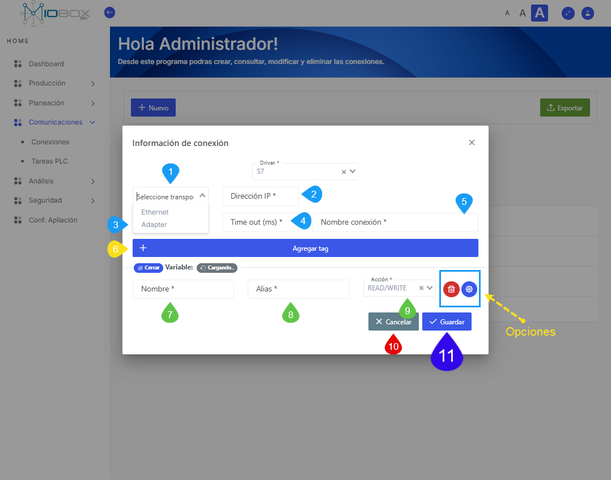
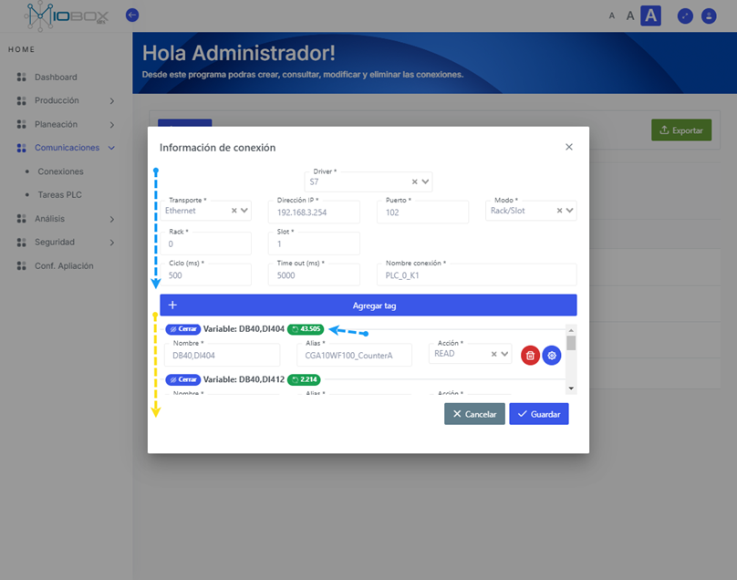

---
prev:
  text: 'Detalle del modulo'
  link: '/planeacion/detalle-del-modulo'
next:
  text: 'Tareas'
  link: '/comunicaciones/tareas'
---
# Módulo de Comunicaciones  

El módulo de comunicaciones se encarga de establecer las conexiones entre la aplicación MIOBOX y los dispositivos de automatización o control industrial. Además, permite definir los tags a monitorear.  

Al ingresar al módulo de comunicaciones, podremos definir los parámetros necesarios para establecer una conexión entre la aplicación MIOBOX y los dispositivos de automatización que cumplan con las características de conexión.  

## Protocolos

La aplicación MIOBOX cuenta con tres tipos de conexión característicos (protocolos de comunicación industrial):  

1. **Industrial Ethernet** (Allen Bradley)  
2. **S7** (Siemens)  
3. **Modbus** (RTU/TCP)  
4. **MQTT** (Message Queuing Telemetry Transport)  

Para configurar una conexión, solo es necesario seguir los siguientes pasos:  

  

Utilice la opción de **+ Nuevo** en el módulo de comunicaciones.  

1. Seleccione el protocolo de conexión.  
2. Elija la opción **Cancelar/Guardar**.  

## Tag  

Un tag es una variable definida dentro de la aplicación MIOBOX que será enlazada a una variable de control. Este tag puede ser de **lectura**, **escritura** o **lectura/escritura**. Un controlador o PLC se define como un dispositivo dentro de la aplicación MIOBOX, y cada dispositivo puede contener un número variable de tags.  

Una vez seleccionada la conexión, deberá definir los parámetros de la conexión, así como los tags a monitorear.  

### Parámetros de la conexión

  

El siguiente ejemplo se realiza sobre una conexión que utiliza el protocolo S7, comúnmente utilizado por controladores Siemens.  

1. Seleccione el medio sobre el cual se realizará la conexión S7.  
2. Defina la dirección IP para conectar con el dispositivo.  
3. Seleccione el tiempo de refresco de conexión (tiempo para interrogar al equipo).  
4. Tiempo para definir que el equipo está fuera de alcance.
5. Establezca un nombre para la conexión.

Una vez definida la información inicial de la conexión, debe continuar agregando los tags relacionados a la conexión. Cada tag tiene las siguientes características:

| Parámetro         | Descripción                                                                           |   valores posibles |
|----------         |-----------                                                                            |   -----------------|
| 7. Nombre         | Nombre de la variable,o dirección de memoria como esta definida en el dispositivo     | Ejemplo: WD400                                        |
| 8. Alias          | Nombre interno para la variable                                                       | string sin caracteres especiales, No usar tildes.     |
| 9. Acción         | Tipo de variable, lectura, escritura o lectura y escritura a la vez                   | read, write o read/write                              |

  