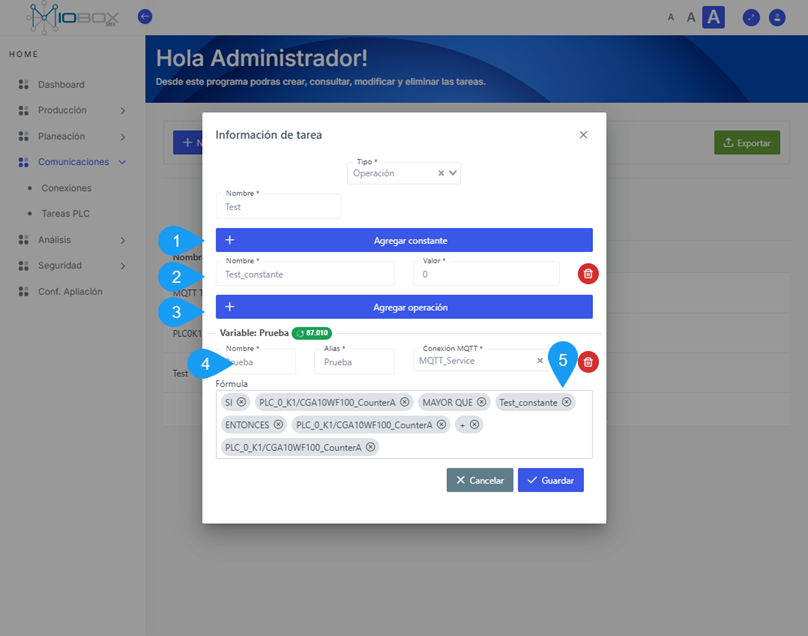

---
prev:
  text: 'Parámetros de la conexión'
  link: '/comunicaciones/parametros-de-la-conexion'
next:
  text: 'Analisis'
  link: '/Analisis/index'
---

# Tareas

Una tarea es la forma en el MIOBOX inicia los procesos de comunicación, siempre debe definir una tarea para arrancar la ejecución de una conexión o
para ejecutar operaciones usando la lista de tags en compañía del panel de operaciones.

.

## Definir una tarea

1. Inicie el modulo de comunicaciones en el componentes tareas PLC.
2. Inicie la operación usando el botón **+Nuevo**.
3. Seleccione entre **Conexión** o **Operación**, la opción conexión pondrá en marcha una conexión definida en el modulo de conexiones. Si selecciona operación, iniciara una tarea calculada.
4. Seleccione la conexión que desea iniciar por medio de una tarea.
5. Establezca un nombre para la tarea.
6. Seleccione **cancelar** o **guardar** la tarea.

### Operaciones

Una tarea también puede llevar a cabo un calculo usando como parámetros los tags definidos en una conexión.

Para definir una operación realice los siguientes pasos. Una vez cree la tarea, seleccione la opción **operación**.

1. Agregue las constantes necesarias para la operación.
2. agregue una constante con valor 0 si lo necesita.
3. Agregue las variables necesarias para la operación que se encuentren definidas en la base de datos de tags.
4. Defina la variable que almacenará la operación.
5. Defina la operación a realizar, el sistema de autocompletado le ayudara a generar la operación.

Al final la operación será como en el ejemplo.