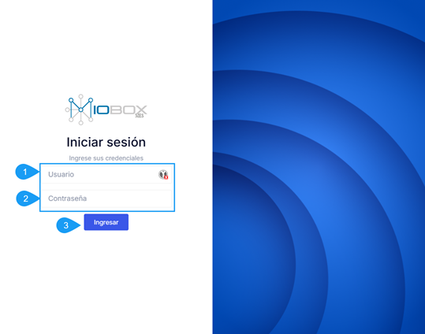
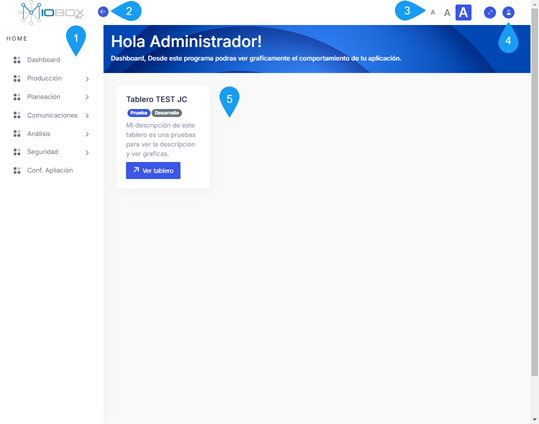

## Primeros pasos

Para iniciar sesión en **MIOBOX**, generalmente se debe proporcionar las siguientes credenciales de acceso:

1. **Usuario:** Este campo solicita el nombre de usuario, también conocido como usuario que se utiliza para identificar al usuario en la aplicación.

2. **Contraseña:** Este campo requiere que el usuario ingrese su contraseña, que es una secuencia secreta de caracteres utilizada para autenticar la identidad del usuario.

3. Una vez que el usuario ha ingresado su nombre de usuario y contraseña,haga click sobre el botón ingresar.

La aplicación procesa estas credenciales para verificar si son válidas y permitir o denegar el acceso a la aplicación. Si las credenciales son correctas, el usuario iniciará sesión y podrá acceder a las funcionalidades y contenido de la aplicación. Si las credenciales son incorrectas, se mostrará un mensaje de error y se solicitará que el usuario vuelva a intentarlo.

Es importante mantener la confidencialidad de las credenciales de acceso y no compartirlas con nadie, ya que esto podría comprometer la seguridad de la cuenta del usuario y la aplicación.

Una vez iniciada la sesión tendrá acceso a todos los componentes de la aplicación que hallan sido asignados al rol de usuario.

##### Componentes de la aplicación:

1. Barra de módulos de aplicación (Sidebar).
2. Botón para ocultar el sidebar.
3. Selección para ampliar o disminuir el texto de la aplicación.
4. Cerrar sesión.
5. Area de visualización.

