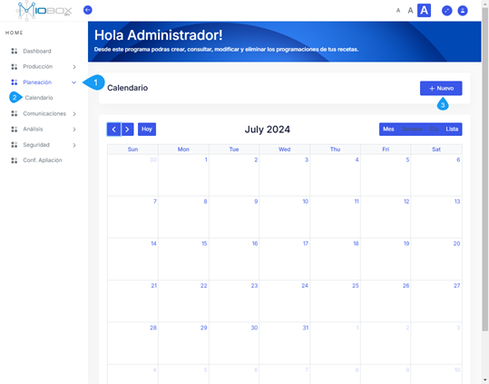

# Módulo de Planeación  

## Objetivo del Módulo  

El objetivo del módulo de planeación es proporcionar una visualización integral de los planes de producción y la elaboración de productos, en función de las líneas de producción disponibles en el sistema. Este módulo optimiza la correlación de los datos almacenados, vinculando todos los procesos de la cadena productiva.  

## Problemas que Busca Resolver

Este módulo aborda el desafío de organizar y mejorar la correlación los datos generados por los dispositivos de automatización y los sistemas de producción. A través de él, es posible obtener una estructura clara de los costos asociados a los recursos necesarios para la fabricación, lo que facilita la planificación de cantidades específicas de materiales y recursos energéticos requeridos en cada receta. Asimismo, la relación de estos datos permite un análisis más efectivo de los costos y pérdidas vinculadas a la producción, posibilitando la comparación de diferentes KPIs entre fabricaciones similares.  

## Funciones Específicas  

El módulo de planeación incluye diversas funciones, tales como:

- Preparación y gestión de recetas temporales y permanentes.  
- Organización de los planes de producción a través de un calendario integrado.  
- Minimizar de pérdidas de material y tiempo durante los cambios de recetas.  
- Seguimiento de cost KPIs a lo largo de diferentes recetas.  

## Beneficios

Utilizar este módulo conlleva múltiples beneficios:

- Mejor organización de los procesos de producción, reduciendo pérdidas de material y tiempo.  
- Interoperabilidad entre los sistemas de producción, lo que facilita la configuración necesaria para cada cambio de receta.  
- Capacidad para realizar un seguimiento detallado de los cost KPIs, lo que permite tomar decisiones basadas en datos.  

## Usuarios Destinatarios

Los principales usuarios de este módulo incluyen:

- Planeadores  
- Jefes de producción  
- Operarios  

## Interacciones con Otros Módulos

El sistema de planeación se integra con todos los módulos de MIOBOX, actuando como un complemento que mejora el seguimiento operativo y la gestión de la producción.  

## Datos Recopilados  

El módulo recopila información crítica, incluyendo:

- Detalles de la receta programada.  
- Materiales y cantidades utilizadas.  
- Puntos de extracción de materiales.  
- Tiempos de fabricación.  
- Cantidad de receta fabricada.  
- Notas de operación.  
- Identificación de usuarios involucrados en la fabricación y la planificación.  
- Consumos energéticos asociados a la receta.  

## Ejemplos Prácticos  

En la práctica, una empresa que cuenta con recetas para la fabricación de productos puede definir diariamente, semanalmente o mensualmente qué productos se necesitan. El módulo de planeación permite ingresar estas definiciones en un calendario de producción. Tras planear, se especifican las fechas, horas y cantidades necesarias, que posteriormente se programan y aprueban para su fabricación.  

## Trazabilidad  

Una vez programada la producción y seleccionado el plan a cargar MIOBOX exporta los parámetros de configuración del equipo necesarios para producir la receta, como por ejemplo: porcentaje de apertura de válvulas, cantidad de aditivos y velocidad de las bandas. Cada producción recibe un ID único que relaciona todos los datos obtenidos durante el proceso, asegurando que la información esté almacenada para análisis futuros.  

## Requisitos y Configuración

Para implementar y utilizar este módulo, es fundamental:

- Definir claramente las recetas.  
- Planificar de manera organizada la fabricación.  
- Establecer una secuencia de producción lógica.  

## Mejoras Futuras

De cara al futuro, se prevé que el módulo se expanda para integrar un mayor volumen de datos relacionados con la producción y el mantenimiento, permitiendo su incorporación a un módulo de inteligencia artificial.  

## Detalles del módulo

1. Ingreso al módulo.
2. Ingreso al calendar de producción.
3. Nueva planeación de fabricación.

