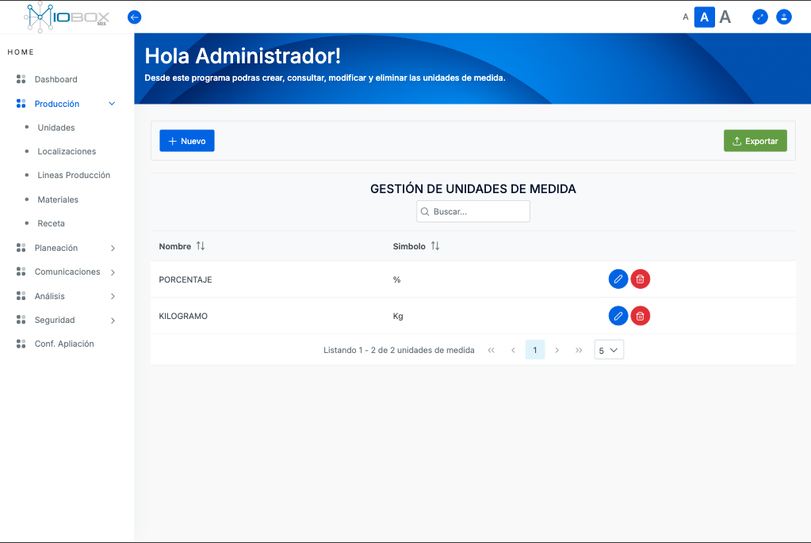
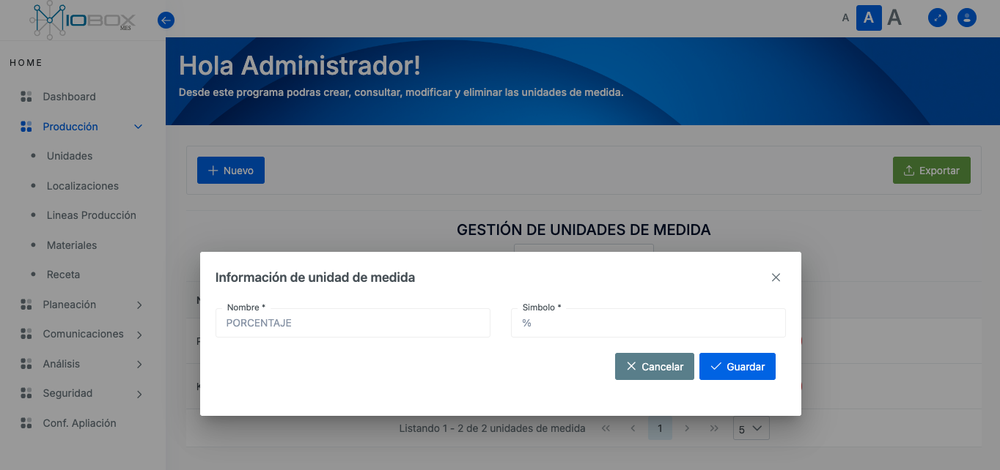
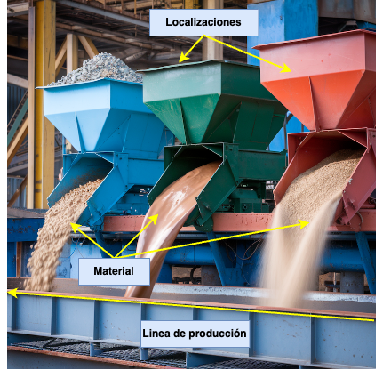
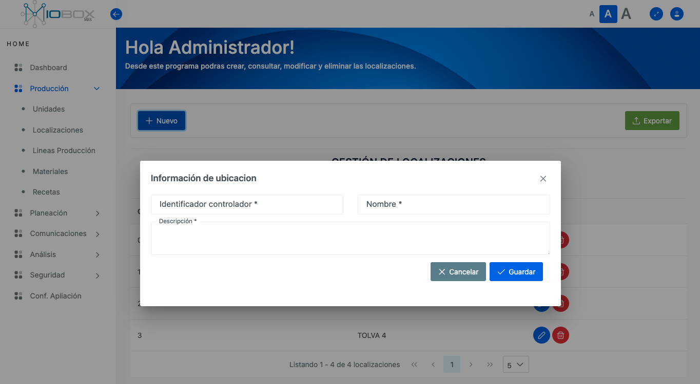
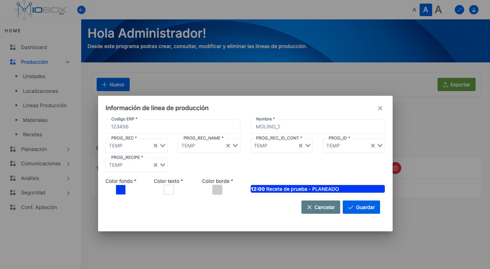
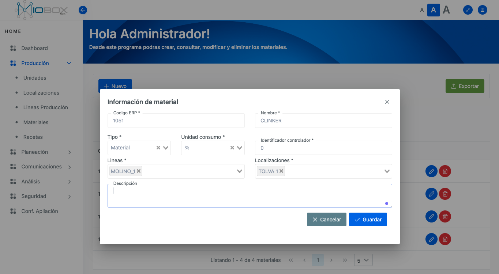
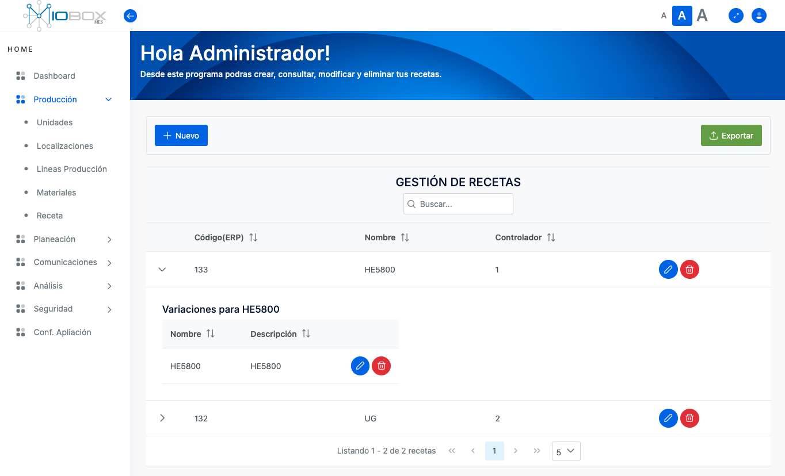
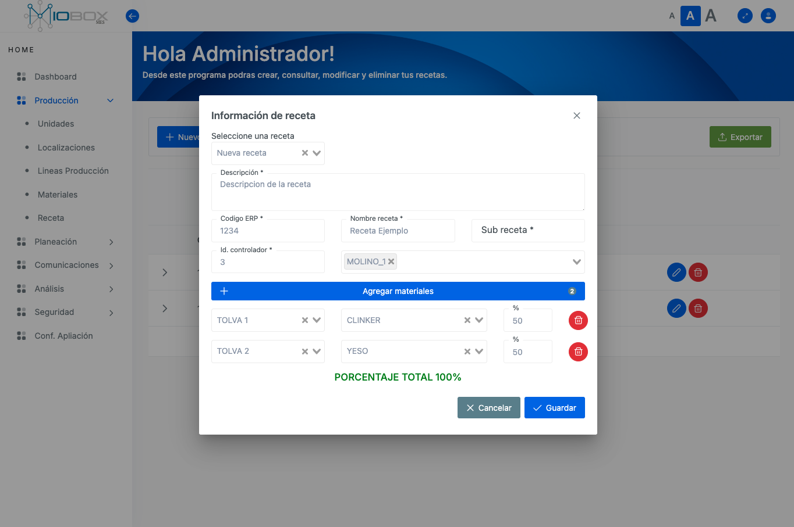

# Módulo de Producción

El módulo de producción incluye los componentes necesarios para la creación de los registros base que utiliza un sistema de producción. Este sistema se basa en líneas de producción que emplean materiales provenientes de diferentes ubicaciones para elaborar uno o más productos, los cuales están definidos en una receta.



##### Opciones

Todos los componentes del módulo de producción están interrelacionados en sus opciones. A continuación, se describe la utilidad de cada una de ellas:

| Opción   | Descripción |
|----------|-------------|
|        | Permite crear un nuevo recurso mediante un formulario. Complete la información necesaria y luego guarde los cambios. |
|  | Permite exportar la información almacenada en formato CSV, facilitando la integración con otras aplicaciones o el análisis de datos en programas de hoja de cálculo. |
|      | Permite modificar el elemento de la línea seleccionada, asegurando que los datos se mantengan actualizados y precisos. |
|  | Permite eliminar el elemento de la línea seleccionada. Esta acción solo está disponible para usuarios con los privilegios necesarios, para proteger los datos críticos de alteraciones no autorizadas. |


***
## Unidades

El componente de unidades define las diferentes unidades de medida que se utilizarán en los componentes de materiales y recetas. Tanto el nombre como el símbolo de las unidades se mostrarán según la preferencia del cliente, sin estar sujetos a normalizaciones locales.

##### Nueva de unidad

Para la creción de una nueva unidad seleccione la opcion **+Nuevo** y complete las opciones necesarias para difinir la unidad.



Puedes utilizar las opciones definidas, como **Editar** o **Eliminar**, para realizar las funciones necesarias empleando los íconos correspondientes.

***
## Localizaciones

El componente Localizaciones define los diferentes puntos de acopio utilizados por una línea de producción. A su vez, también define la ubicación desde donde se ingresará un material para la construcción de un producto a través de una receta.

La siguiente imagen muestra los componentes básicos para la creación de los elementos a continuación.



##### Nueva Localización

Para la creción de una nueva localizació seleccione la opcion **+Nuevo** y complete las opciones necesarias para difinirla.



Puedes utilizar las opciones definidas, como **Editar** o **Eliminar**, para realizar las funciones necesarias empleando los íconos correspondientes.
::: tip
**Nota:** Tenga en cuenta que el número de identificación del controlador debe ser un número entero consecutivo. Este valor se utiliza como interfaz para mantener una relación con su sistema de automatización.
:::

::: tip
***El sistema no permitirá crear dos localizaciones con un mismo numero de identificación de controlador.***
:::

***
## Líneas de Producción

El componente **Línea de Producción** permite definir un número N de líneas de producción sobre las cuales se definirán o programarán la ejecución de recetas o procesos. Estas líneas de producción se asocian generalmente a un código ERP dentro de la organización para integrarse con otros sistemas.

Solo en el caso de contar con el módulo de planificación se definirán nombres para las variables de intercambio de información. Estas variables deben estar definidas previamente en el módulo de comunicaciones.

Utilice la opción **+ Nuevo** para crear una nueva línea de producción y/o las opciones **Editar** o **Eliminar** cuando sea necesario.

Los colores definidos en las líneas de producción sirven para identificar las líneas en el módulo de planificación.



##### Parametros Opcionales:
```
PROG_REC
PROG_RED_NAME
PROG_RED_ID_CONT
PROG_ID
PROG_RECIPE
```

***
## Materiales

Este componente define todos los materiales disponibles para la preparación de una receta que, al final, se transformará en un producto terminado.

Finalmente, las opciones de creación para este componente dependerán de las definiciones realizadas en los componentes **Unidades**, **Líneas de Producción** y **Localizaciones**. Por tanto, no podrá definir materiales si previamente no ha establecido valores en estos módulos.



##### Parámetros a definir

| Opción          | Descripción                                                                                  |
|-----------------|----------------------------------------------------------------------------------------------|
| Código ERP      | Define el código establecido en el ERP con el que se realiza el registro de los movimientos del material. |
| Nombre          | Define el nombre con el que se identificará el material en la aplicación.                      |
| Tipo            | Establece dos opciones: Material o Aditivo (personalizable por cliente).                      |
| Líneas          | Selecciona las líneas de producción a las que se le permite el uso de este material. Esta opción restringe al módulo de planificación. |
| Localizaciones  | Indica desde qué punto será suministrado el material. Puede utilizar un punto o varios puntos. Esta opción restringe al módulo de planificación. |
| Descripción     | Define comentarios específicos del usuario para el material u opciones a tener en cuenta (solo carácter informativo). |

***
## Recetas

Este módulo define las condiciones para la creación de una receta que permita lograr un producto final. Cada receta especifica qué materiales (ingredientes) se utilizan y el porcentaje de aplicación de cada material.

Las recetas se asocian a un identificador de controlador para intercambiar datos entre el sistema de información y el sistema de automatización.

Asimismo, se requiere un código ERP para relacionar el producto terminado con el sistema de información utilizado por la compañía.

Siempre debe identificarse a qué línea o líneas de producción se asociará la receta. A esta receta la llamaremos **Receta Padre**.

Cada vez que se defina una **Receta Padre**, se deben especificar las variaciones que puede tener una misma receta. A estas variaciones las llamaremos **Subreceta**. Una **Subreceta** define los materiales que se utilizan para construir una **Receta Padre**, lo que permite que el sistema tenga diferentes recetas que finalmente produzcan el mismo producto final.

Si no existen variaciones para una **Receta Padre**, solo se definirá una **Subreceta**.

Haga clic sobre el botón expandir  para observar las variaciones de una receta.



##### Crear una receta

1. Para crear una nueva receta, haga clic sobre el botón **+ Nuevo**. Se abrirá el formulario de creación. En el selector *Seleccione una receta*, escoja **Nueva receta**.
   
2. Describa la receta, agregue el correspondiente *Código ERP* y *Nombre de receta*. Si es una *Receta Padre*, no indique valores de Subreceta.

3. El ID de controlador propondrá un valor consecutivo, pero puede modificarlo si lo desea (siempre debe ser un número consecutivo).

4. Seleccione las líneas de producción sobre las que se podrá fabricar la receta.

5. Agregue los materiales necesarios para la fabricación de la receta e indique los porcentajes (%) para cada material. El porcentaje total debe ser 100%.

::: tip
**Nota**: Complete los campos en forma ordenada de arriba hacia abajo.
:::

Al finalizar, obtendrá algo como esto:



