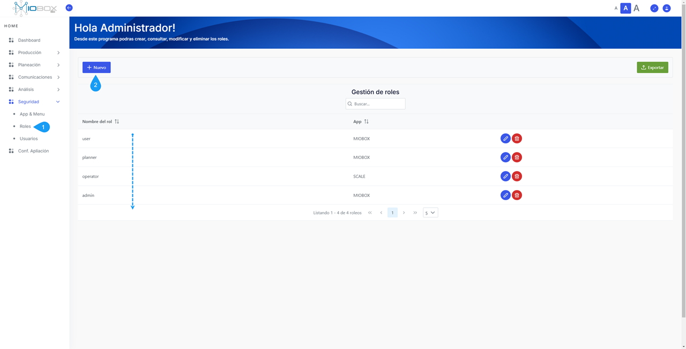
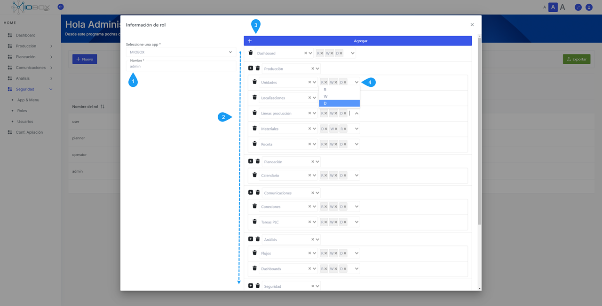
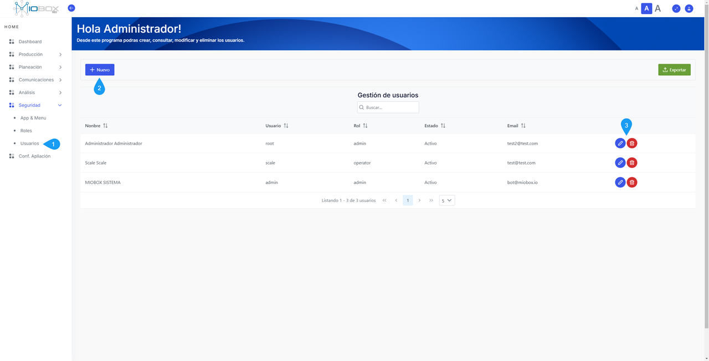
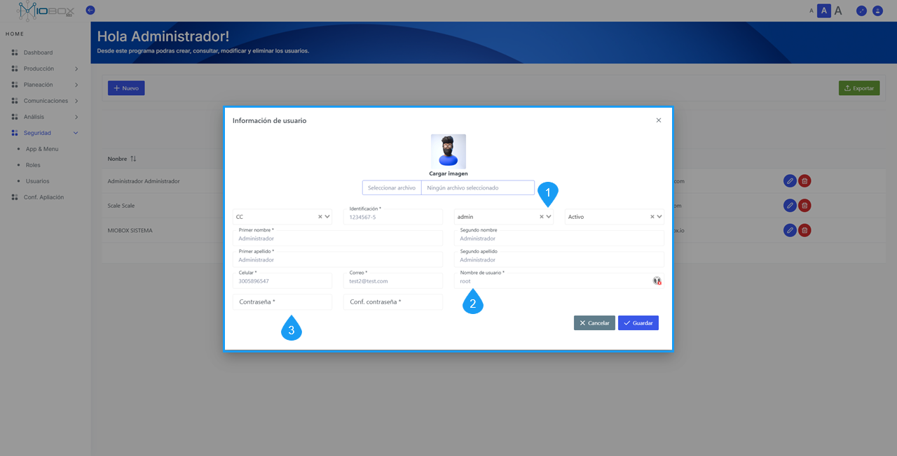

---
prev:
  text: 'Analisis'
  link: '/Analisis/index'
next:
  text: 'API'
  link: '/operations/index'
---
# Seguridad  

El módulo de seguridad permite definir los roles de acceso a la aplicación y gestionar las credenciales de acceso de los usuarios.  

::: tip  
*Próximamente:* El módulo de seguridad permitirá la validación de usuarios utilizando métodos de autenticación a través de la herramienta Directorio Activo (AD) de Microsoft, con el objetivo de centralizar las credenciales y administrar todo desde un único punto.  
:::  

  

A través del acceso a los roles, podrá observar que, inicialmente, los roles establecidos son:  

| Tipo de Rol | Descripción                                                                                     |  
|-------------|-------------------------------------------------------------------------------------------------|  
| admin       | Acceso completo a todas las configuraciones del sistema en modo de lectura y escritura, permite eliminar datos. |  
| planner     | Acceso parcial a la visualización y edición de datos, sin posibilidad de eliminar información en ningún módulo. |  
| operator    | Solo puede visualizar y operar en algunos módulos.                                           |  
| user        | Solo tiene acceso a la visualización de dashboards.                                           |  

## Crear, Editar o Eliminar Roles  

Es posible editar los roles existentes en el sistema o crear nuevos roles mediante el componente correspondiente. Para esto, es necesario seleccionar el rol que desea editar o crear uno nuevo:  

1. Defina un nombre para el rol que desea crear.  
2. Editar los módulos a los que el rol debe tener acceso.  
3. Agregar un nuevo módulo al rol, si es necesario.  
4. Seleccionar el tipo de acceso.  

| Tipo | Descripción            |  
|------|------------------------|  
| R    | Solo lectura           |  
| W    | Solo escritura         |  
| D    | Permiso de eliminación  |  

  

## Crear, Editar o Eliminar Usuarios  

Puede utilizar las opciones disponibles para crear, editar o eliminar usuarios.  

1. Seleccione el componente de usuario.  
2. Haga clic en **+ Nuevo** para crear un nuevo usuario o seleccione un usuario existente para editarlo.  

*Imagen de ejemplo:*  

  

### Información de Usuarios  

Una vez que haya seleccionado el usuario, podrá editar la siguiente información:  

1. Rol asignado.  
2. Nombre de usuario para inicio de sesión.  
3. Contraseña y confirmación de contraseña.  

*Imagen de ejemplo:*  

  